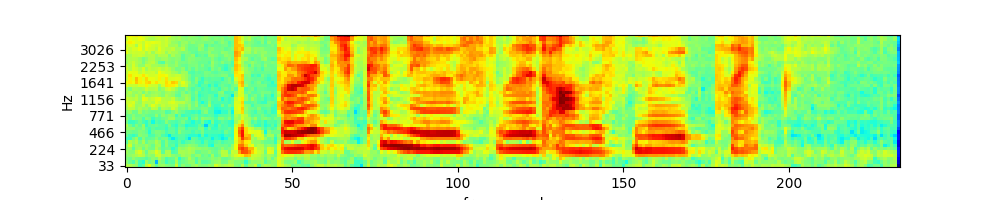

# SoundAnalysisPlayground
Playing around with sound to understand sound analysis classic and modern approach

## Understanding music source separation

#### understanding Signal to Distortion Ratio
SDR is the most popular metric for measuring source separation. Lets's understand it
- SDR paper https://hal.inria.fr/inria-00544230/document
- Paper by google examining SDR http://www.jonathanleroux.org/pdf/LeRoux2019ICASSP05sdr.pdf
#### Source separation with Deezer-Spleeter
Here is an example of source separation done using Deezer-Spleeter [1] to a sampple from the white stripes song Seven Nation Army:

[Source](sound_snippets/SevenNationArmy_trimmed.mp3)

[Vocal](assets/understanding_source_separation/SevenNationArmy/vocals.wav)

[Bass](assets/understanding_source_separation/SevenNationArmy/bass.wav)

[Drums](assets/understanding_source_separation/SevenNationArmy/drums.wav)

[other](assets/understanding_source_separation/SevenNationArmy/other.wav)

[Full accompaniment](assets/understanding_source_separation/SevenNationArmy/accompaniment.wav)

## Understanding spectograms
understanding_spectograms.py contains a reimplementation of https://haythamfayek.com/2016/04/21/speech-processing-for-machine-learning.html

It basicaly creates a mel-scale spectogram from a .wav file

# More credits:
- https://dspillustrations.com/pages/posts/misc/spectral-leakage-zero-padding-and-frequency-resolution.html